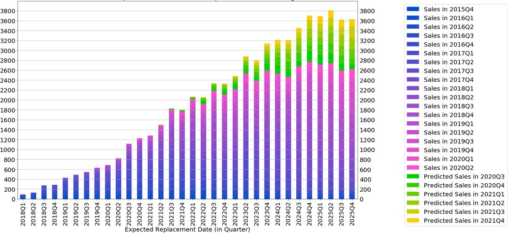

## Sales Demand Analysis and Prediction

#### Goal: improve future marketing and sales strategies through data-driven insights.

#### This repo provides data analysis to transformed product lifecycle data and historical sales data into actionable insights, forecasting replacement cycles and demand to guide marketing and sales strategy.

##### Background: A medical device company supplies products to patients worldwide. Each product has a limited service life and must be replaced when its built-in battery is depleted or the device reaches end-of-life. To support proactive planning, the marketing and the sales teams need accurate forecasts of replacement timing so they can prepare ahead for future marketing and sales strategies.

#### [View Code (SalesDemandAnalysis&Prediction.ipynb)](SalesDemandAnalysis&Prediction.ipynb) for the detailed methods.

#### Some selected results are shown below

